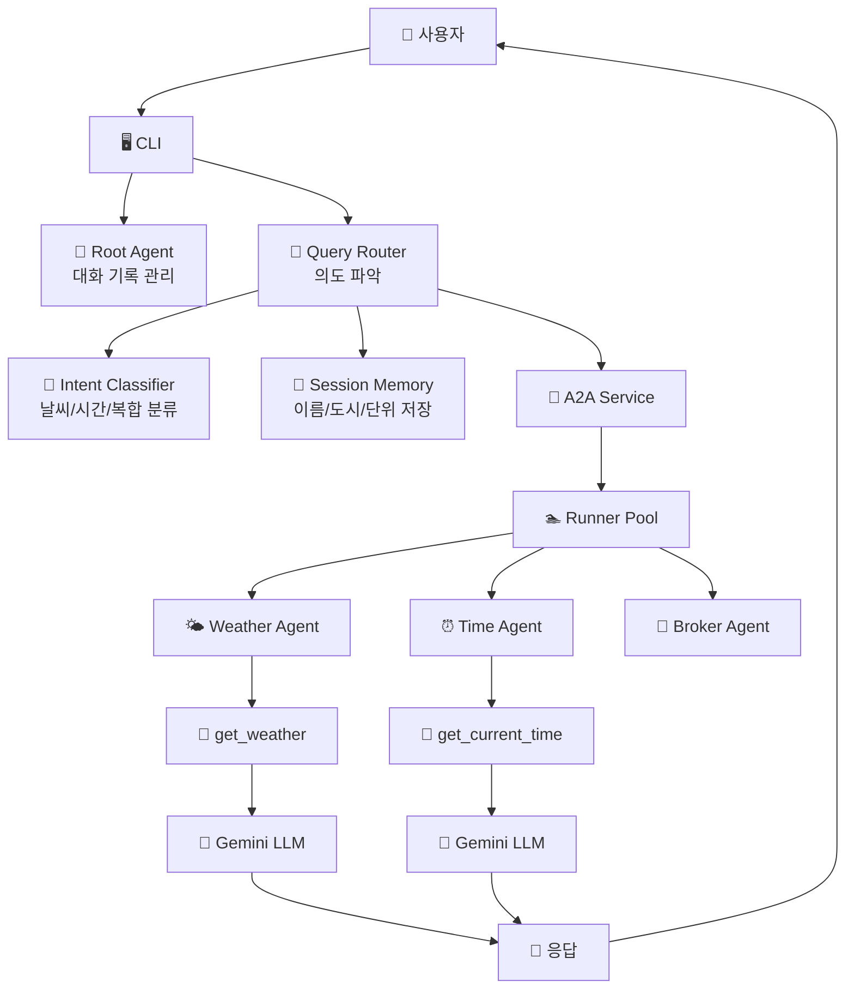
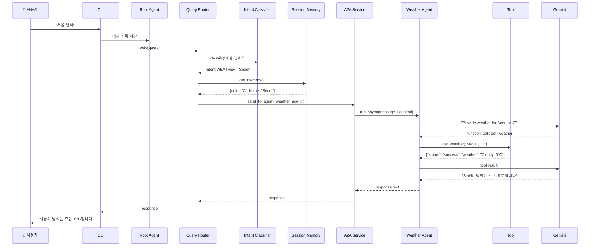
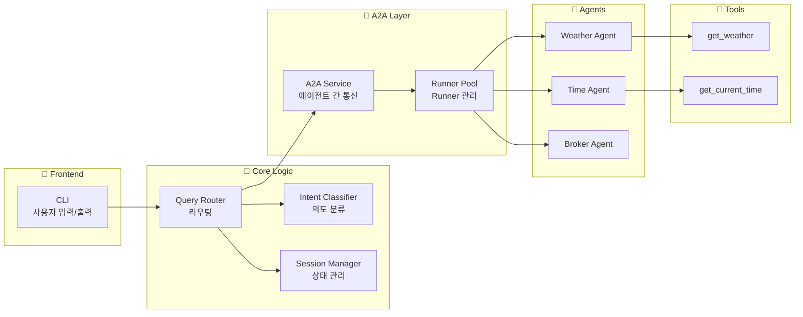

# A2A (Agent-to-Agent) Communication System

Google ADK 기반의 다중 에이전트 통신 시스템입니다. 에이전트끼리 협력하여 사용자 질의에 응답합니다.

## � 시스템 흐름도

### 전체 아키텍처


### 사용자 쿼리 처리 흐름


### 컴포넌트별 역할


## 🚀 빠른 시작

### 1. 환경 설정

```bash
# 가상환경 생성 및 활성화
python -m venv .venv
.venv\Scripts\activate  # Windows
source .venv/bin/activate  # Linux/Mac

# 의존성 설치
pip install google-adk python-dotenv
```

### 2. API 키 설정

`.env` 파일 생성:
```bash
cp .env.example .env
```

`.env` 파일에 API 키 입력:
```
GOOGLE_API_KEY=your_actual_api_key_here
GOOGLE_GENAI_USE_VERTEXAI=False
```

### 3. 실행

```bash
python a2a_team_cli.py
```

## 💬 사용 예시

```
You: 서울 날씨
<<< 서울의 날씨는 흐림이며, 기온은 5°C입니다.

You: 내 이름은 JK
<<< 알겠습니다, JK님.

You: 단위를 화씨로 바꿔줘
<<< 단위를 화씨(°F)로 설정했습니다.

You: 도쿄 시간
<<< 도쿄의 현재 시간은 오전 4시 30분입니다.

You: 런던 시간과 날씨
<<< 런던의 현재 시간은 오후 11시 30분이며, 날씨는 비가 내리고 있고 기온은 46°F입니다.
```

## 🏗️ 프로젝트 구조

```
A2A_tutorial/
├── 📄 a2a_team_cli.py          # CLI 진입점
├── 📄 requirements.txt         # 의존성
├── 📄 .env.example            # 환경변수 템플릿
└── 📁 my_agent/
    ├── 📄 tools.py            # 🔧 도구 함수 (get_weather, get_time)
    ├── 📄 team.py             # 🏗️ 팀 구성 및 초기화
    │
    ├── 📁 config/             # ⚙️ 설정
    │   └── settings.py        # 환경변수 로드 및 검증
    │
    ├── 📁 core/               # 🎯 핵심 추상화
    │   ├── memory.py          # 사용자 메모리 (이름/도시/단위)
    │   ├── session_manager.py # 세션 관리
    │   └── exceptions.py      # 커스텀 예외
    │
    ├── 📁 services/           # 🔄 비즈니스 로직
    │   ├── runner_pool.py     # Runner 풀 관리
    │   ├── a2a_service.py     # A2A 통신 서비스
    │   ├── intent_classifier.py # 의도 분류기
    │   └── query_router.py    # 쿼리 라우터
    │
    └── 📁 agents/             # 🤖 에이전트 정의
        ├── weather_agent.py   # 날씨 에이전트
        ├── time_agent.py      # 시간 에이전트
        ├── broker_agent.py    # 중개 에이전트
        └── root_agent.py      # 루트 에이전트
```

## 🎯 핵심 개념

### 1️⃣ Agent (에이전트)
- **역할**: 특정 도메인의 작업을 처리하는 LLM 기반 엔티티
- **예시**: `weather_agent`는 날씨 정보만 제공
- **구성**: `model`, `name`, `instruction`, `tools`

### 2️⃣ Tool (도구)
- **역할**: 에이전트가 실제 작업을 수행하는 함수
- **예시**: `get_weather(city, units)` - 도시 날씨 조회
- **특징**: LLM이 자동으로 호출 여부 결정

### 3️⃣ Runner
- **역할**: 에이전트를 실행하고 대화 관리
- **핵심 메서드**: `run_async()` - 비동기로 에이전트 실행
- **관리**: `RunnerPool`이 각 에이전트별 Runner 관리

### 4️⃣ A2A Service
- **역할**: 에이전트 간 통신 조율
- **메커니즘**: `send_to_agent()` → Runner 찾기 → `run_async()` 호출
- **응답 처리**: 이벤트 스트림에서 최종 텍스트 추출

### 5️⃣ Session Memory
- **역할**: 사용자별 개인화 데이터 저장
- **저장 항목**: `user_name`, `home_city`, `preferred_units`
- **활용**: 쿼리 라우팅 시 기본값으로 사용

### 6️⃣ Intent Classifier
- **역할**: 사용자 입력에서 의도 파악
- **분류**: WEATHER, TIME, COMBINED, SET_NAME, SET_UNITS
- **추출**: 엔티티 (도시명) 추출

## 🔄 A2A 통신 과정

### 단계별 상세 흐름

1. **사용자 입력**
   - CLI에서 "서울 날씨" 입력

2. **Root Agent 기록**
   - Root Runner가 대화 히스토리에 저장
   - 이후 대화 컨텍스트 유지

3. **의도 분류**
   - `IntentClassifier`가 쿼리 분석
   - "날씨" 키워드 감지 → `Intent.WEATHER`
   - "서울" 추출 → entity: "Seoul"

4. **메모리 조회**
   - `SessionManager`에서 사용자 설정 로드
   - preferred_units: "C", home_city: "Seoul"

5. **A2A 호출**
   - `QueryRouter` → `A2AService.send_to_agent()`
   - 대상: "weather_agent"
   - 메시지: "Provide weather for Seoul in C. Use get_weather tool."
   - 컨텍스트: "(User:JK, Home:Seoul, Units:C)"

6. **Weather Agent 실행**
   - `RunnerPool`에서 weather_agent의 Runner 가져오기
   - `runner.run_async()` 호출
   - LLM이 instruction 읽고 도구 사용 결정

7. **Tool 실행**
   - LLM이 `function_call: get_weather("Seoul", "C")` 생성
   - ADK가 자동으로 `get_weather()` 함수 호출
   - 반환: `{"status": "success", "weather": "Cloudy, 5°C"}`

8. **LLM 응답 생성**
   - 도구 결과를 다시 LLM에 전달
   - LLM이 자연어로 변환: "서울의 날씨는 흐림이며 기온은 5°C입니다."

9. **응답 추출 및 반환**
   - `A2AService`가 이벤트 스트림에서 최종 텍스트만 추출
   - `QueryRouter` → CLI → 사용자에게 출력

## 📝 지원 명령

- **날씨 조회**: "서울 날씨", "Tokyo weather"
- **시간 조회**: "도쿄 시간", "London time"
- **복합 조회**: "런던 시간과 날씨"
- **이름 설정**: "내 이름은 JK", "My name is JK"
- **단위 설정**: "단위를 섭씨로", "단위를 화씨로"

## 🔧 확장 가이드

### 새 에이전트 추가하기

1. **도구 함수 작성** ([`my_agent/tools.py`](my_agent/tools.py ))
```python
def get_stock_price(symbol: str) -> dict:
    """주식 가격 조회"""
    return {"status": "success", "symbol": symbol, "price": "150.25"}
```

2. **에이전트 생성** (`my_agent/agents/stock_agent.py`)
```python
from google.adk.agents import Agent
from ..tools import get_stock_price

def create_stock_agent() -> Agent:
    return Agent(
        name="stock_agent",
        model="gemini-2.0-flash",
        description="주식 가격 정보 제공",
        instruction="Use get_stock_price tool to fetch stock prices.",
        tools=[get_stock_price],
    )
```

3. **팀에 등록** ([`my_agent/team.py`](my_agent/team.py ))
```python
from .agents import create_stock_agent

self.stock_agent = create_stock_agent()
self.runner_pool.register_agent(self.stock_agent)
```

4. **의도 추가** ([`my_agent/services/intent_classifier.py`](my_agent/services/intent_classifier.py ))
```python
class Intent(Enum):
    STOCK = "stock"  # 추가

# classify() 메서드에 로직 추가
if "주가" in q or "stock" in q:
    return (Intent.STOCK, self._extract_symbol(q))
```

5. **라우팅 추가** ([`my_agent/services/query_router.py`](my_agent/services/query_router.py ))
```python
elif intent == Intent.STOCK:
    return await self.a2a_service.send_to_agent(
        agent_name="stock_agent",
        message=f"Get stock price for {entity}",
        ...
    )
```

## 🐛 문제 해결

### "Agent not found" 오류
- `RunnerPool`에 에이전트가 등록되었는지 확인
- [`my_agent/team.py`](my_agent/team.py )의 `__init__`에서 `register_agent()` 호출 확인

### "Session not found" 오류
- CLI에서 `ensure_session()` 호출 확인
- `session_service.create_session()` 선행 실행 필요

### "function_call" 경고
- 정상 동작이며 무시 가능
- 도구가 실행되고 있다는 신호

### API 키 오류
- `.env` 파일에 `GOOGLE_API_KEY` 설정 확인
- `python-dotenv` 설치 및 `load_dotenv()` 호출 확인

## 📄 라이선스

MIT
