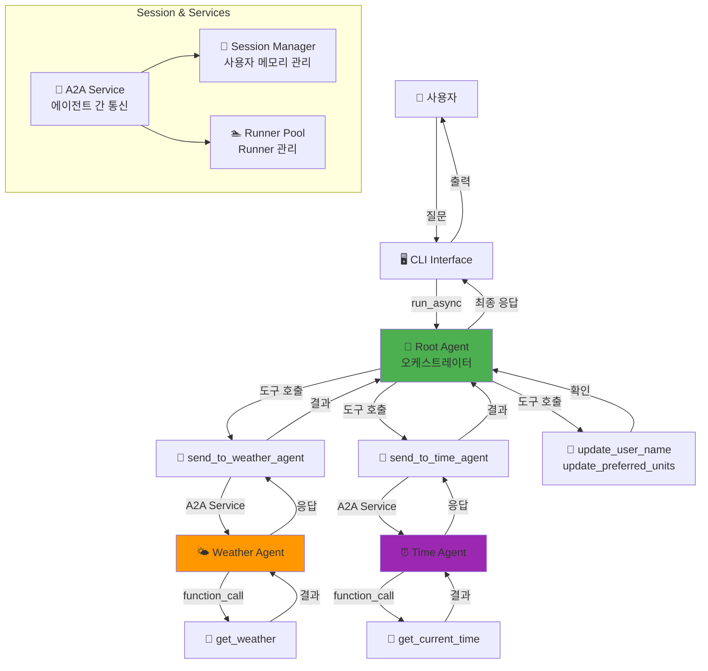
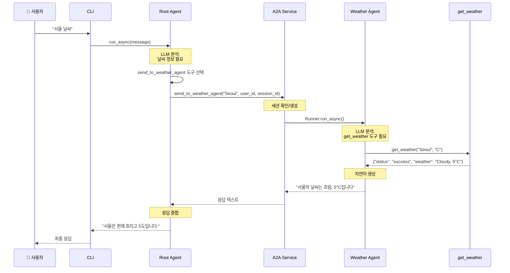
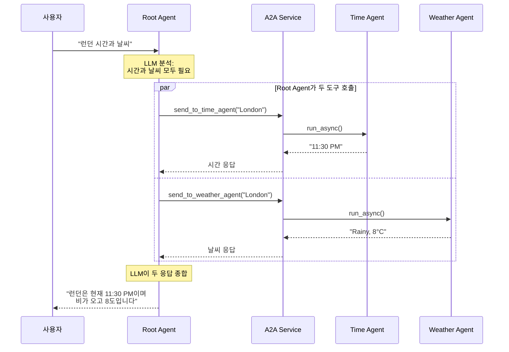

# A2A (Agent-to-Agent) Communication System

Google ADK 기반 다중 에이전트 통신 시스템입니다. 여러 전문화된 에이전트들이 협력하여 사용자의 복잡한 질의를 처리합니다.

## 📋 프로젝트 개요

이 프로젝트는 **LLM 기반 에이전트들이 도구(Tool)를 통해 서로 통신하며 협력**하는 멀티 에이전트 시스템입니다. Root Agent가 사용자 요청을 분석하고 적절한 전문 에이전트에 작업을 위임하며, 여러 에이전트의 응답을 종합하여 최종 답변을 생성합니다.

### 주요 특징

- 🤖 **LLM 기반 의도 파악**: Gemini 2.0 Flash가 자연어 이해 및 도구 선택
- 🔧 **Tool 기반 A2A 통신**: 에이전트 간 통신을 도구로 추상화
- 🎯 **전문화된 에이전트**: 날씨, 시간 등 도메인별 전문 에이전트
- 💾 **세션 메모리**: 사용자별 개인화 설정 저장 (이름, 선호 단위)
- ⚡ **비동기 처리**: asyncio 기반 효율적인 에이전트 실행

## 🏗️ 시스템 아키텍처

### 전체 구조



### 서비스 처리 흐름



### 복합 질의 처리 (시간 + 날씨)



## 🤖 에이전트 역할

### 1. Root Agent (오케스트레이터)
- **파일**: `my_agent/agents/root_agent.py`
- **모델**: Gemini 2.0 Flash
- **역할**: 
  - 사용자 요청 진입점
  - 질의 의도 파악 (LLM 기반)
  - 적절한 도구 선택 및 실행
  - 복합 질의 시 여러 에이전트 조율
  - 최종 응답 생성
- **보유 도구**:
  - `send_to_weather_agent(city, user_id, session_id)` - 날씨 정보 요청
  - `send_to_time_agent(city, user_id, session_id)` - 시간 정보 요청
  - `update_user_name(name, user_id, session_id)` - 사용자 이름 설정
  - `update_preferred_units(units, user_id, session_id)` - 온도 단위 설정 (C/F)

### 2. Weather Agent (날씨 전문가)
- **파일**: `my_agent/agents/weather_agent.py`
- **모델**: Gemini 2.0 Flash
- **역할**: 특정 도시의 날씨 정보 제공
- **보유 도구**:
  - `get_weather(city, units)` - 날씨 데이터 조회 (섭씨/화씨 지원)
- **지원 도시**: Seoul, New York, London, Tokyo

### 3. Time Agent (시간 전문가)
- **파일**: `my_agent/agents/time_agent.py`
- **모델**: Gemini 2.0 Flash
- **역할**: 특정 도시의 현재 시간 제공
- **보유 도구**:
  - `get_current_time(city)` - 시간 데이터 조회
- **지원 도시**: Seoul, New York, London, Tokyo

## 🔄 핵심 컴포넌트

### A2A Service (에이전트 간 통신)
- **파일**: `my_agent/services/a2a_service.py`
- **역할**: 에이전트 간 메시지 전달 및 응답 처리
- **기능**:
  - 대상 에이전트 Runner 조회
  - 세션 자동 생성 (없을 경우)
  - 비동기 메시지 전송 및 응답 수신
  - 이벤트 스트림에서 텍스트 추출

### Runner Pool (Runner 관리)
- **파일**: `my_agent/services/runner_pool.py`
- **역할**: 각 에이전트의 Runner 인스턴스 관리
- **기능**:
  - 에이전트 등록 및 Runner 생성
  - 이름으로 Runner 조회
  - 에이전트 존재 여부 확인

### Session Manager (세션 관리)
- **파일**: `my_agent/core/session_manager.py`
- **역할**: 사용자별 세션 및 메모리 관리
- **저장 데이터**:
  - `user_name`: 사용자 이름 (기본: "User")
  - `home_city`: 기본 도시 (기본: "Seoul")
  - `preferred_units`: 온도 단위 (기본: "C")

## 🚀 빠른 시작

### 1. 환경 설정

```bash
# 저장소 클론
git clone https://github.com/JAEKWANG97/A2A_test.git
cd A2A_test

# 가상환경 생성 및 활성화
python -m venv .venv
.venv\Scripts\activate  # Windows
source .venv/bin/activate  # Linux/Mac

# 의존성 설치
pip install google-adk python-dotenv
```

### 2. API 키 설정

`.env` 파일 생성:
```bash
GOOGLE_API_KEY=your_google_api_key_here
GOOGLE_GENAI_USE_VERTEXAI=False
```

### 3. 실행

```bash
python a2a_team_cli.py
```

## 💬 사용 예시

```
You: 서울 날씨
<<< 서울의 날씨는 흐림이며, 기온은 5°C입니다.

You: 내 이름은 JK
<<< 알겠습니다, JK님.

You: 단위를 화씨로
<<< 단위를 화씨(°F)로 설정했습니다.

You: 도쿄 시간
<<< 도쿄의 현재 시간은 오전 4시 30분입니다.

You: 런던 시간과 날씨
<<< 런던은 현재 오후 11시 30분이며, 비가 내리고 있고 기온은 46°F입니다.
```

## 📁 프로젝트 구조

```
A2A_tutorial/
├── a2a_team_cli.py              # CLI 진입점
├── requirements.txt             # 의존성 목록
├── .env.example                # 환경변수 템플릿
├── test_a2a.py                 # 테스트 스크립트
│
└── my_agent/                   # 메인 패키지
    ├── tools.py                # 도구 함수 정의
    ├── team.py                 # 팀 구성 및 초기화
    │
    ├── config/                 # 설정
    │   └── settings.py         # 환경변수 로드 및 검증
    │
    ├── core/                   # 핵심 추상화
    │   ├── memory.py           # 사용자 메모리 데이터 클래스
    │   ├── session_manager.py  # 세션 관리
    │   └── exceptions.py       # 커스텀 예외
    │
    ├── services/               # 비즈니스 로직
    │   ├── runner_pool.py      # Runner 풀 관리
    │   └── a2a_service.py      # A2A 통신 서비스
    │
    └── agents/                 # 에이전트 정의
        ├── root_agent.py       # 루트 에이전트 (오케스트레이터)
        ├── weather_agent.py    # 날씨 에이전트
        └── time_agent.py       # 시간 에이전트
```

## 🔧 확장 가이드

### 새 에이전트 추가하기

#### 1. 도구 함수 작성 (`my_agent/tools.py`)

```python
def get_stock_price(symbol: str) -> dict:
    """주식 가격 조회 도구"""
    # 실제 API 호출 또는 데이터 조회
    return {
        "status": "success",
        "symbol": symbol,
        "price": "150.25",
        "currency": "USD"
    }
```

#### 2. 에이전트 생성 (`my_agent/agents/stock_agent.py`)

```python
from google.adk.agents import Agent
from ..config import get_settings
from ..tools import get_stock_price

def create_stock_agent() -> Agent:
    """주식 에이전트 생성"""
    settings = get_settings()
    return Agent(
        name="stock_agent",
        model=settings.model_name,
        description="주식 가격 정보를 제공하는 전문 에이전트",
        instruction=(
            "You are a stock information agent. "
            "Use get_stock_price tool to fetch stock prices. "
            "Respond naturally in Korean."
        ),
        tools=[get_stock_price],
    )
```

#### 3. A2A 통신 도구 추가 (`my_agent/tools.py`)

```python
def create_a2a_tools(a2a_service, session_manager):
    # 기존 도구들...
    
    async def send_to_stock_agent(symbol: str, user_id: str, session_id: str) -> str:
        """Send request to stock agent."""
        return await a2a_service.send_to_agent(
            agent_name="stock_agent",
            message=f"Get stock price for {symbol}",
            user_id=user_id,
            session_id=session_id
        )
    
    return {
        # 기존 도구들...
        "send_to_stock_agent": send_to_stock_agent,
    }
```

#### 4. Root Agent instruction 업데이트 (`my_agent/agents/root_agent.py`)

```python
def create_root_agent(a2a_tools: dict) -> Agent:
    return Agent(
        name="root_agent",
        instruction=(
            "...(기존 instruction)...\n"
            "   - send_to_stock_agent(symbol, user_id, session_id): Get stock price\n"
            "..."
        ),
        tools=[
            # 기존 도구들...
            a2a_tools["send_to_stock_agent"],
        ],
    )
```

#### 5. 팀에 등록 (`my_agent/team.py`)

```python
from .agents import create_stock_agent  # import 추가

class AgentTeam:
    def __init__(self, session_service, app_name):
        # ...
        self.stock_agent = create_stock_agent()
        self.runner_pool.register_agent(self.stock_agent)
        # ...
```

## 🎯 지원 명령

| 명령 | 설명 | 호출되는 에이전트 |
|------|------|------------------|
| "서울 날씨" | 날씨 정보 조회 | Weather Agent |
| "도쿄 시간" | 시간 정보 조회 | Time Agent |
| "런던 시간과 날씨" | 복합 정보 조회 | Time + Weather Agents |
| "내 이름은 홍길동" | 사용자 이름 설정 | Session Manager |
| "단위를 화씨로" | 온도 단위 설정 | Session Manager |

## 🐛 문제 해결

### "Agent not found" 오류
**원인**: RunnerPool에 에이전트가 등록되지 않음  
**해결**: `my_agent/team.py`에서 `runner_pool.register_agent()` 호출 확인

### "Session not found" 오류
**원인**: 세션이 생성되지 않음  
**해결**: 현재는 A2A Service에서 자동 생성되므로 발생하지 않아야 함. 발생 시 `session_manager`가 A2AService에 전달되었는지 확인

### API 키 오류
**원인**: 환경변수 미설정  
**해결**: `.env` 파일에 `GOOGLE_API_KEY` 설정 확인

### 응답이 없음
**원인**: Root Agent가 도구를 호출하지 않음  
**해결**: 
- Root Agent instruction 확인
- 질문이 명확한지 확인 ("날씨" 키워드 포함)
- API 키가 유효한지 확인

## 📚 기술 스택

- **Google ADK**: 에이전트 프레임워크
- **Gemini 2.0 Flash**: LLM 모델
- **Python 3.11+**: 프로그래밍 언어
- **asyncio**: 비동기 처리
- **python-dotenv**: 환경변수 관리

## 🤝 기여

이슈나 PR은 언제든 환영합니다!

## 📄 라이선스

MIT License

## 📖 참고 자료

- [Google ADK Documentation](https://github.com/google/agentic-developer-kit)
- [Gemini API Documentation](https://ai.google.dev/docs)
- [GETTING_STARTED.md](GETTING_STARTED.md) - 초보자 가이드
