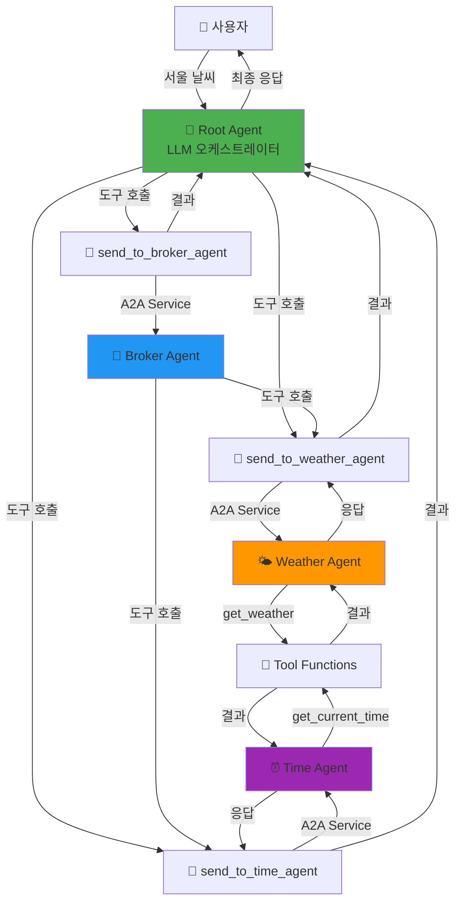
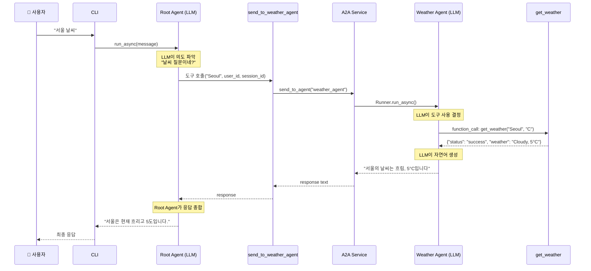
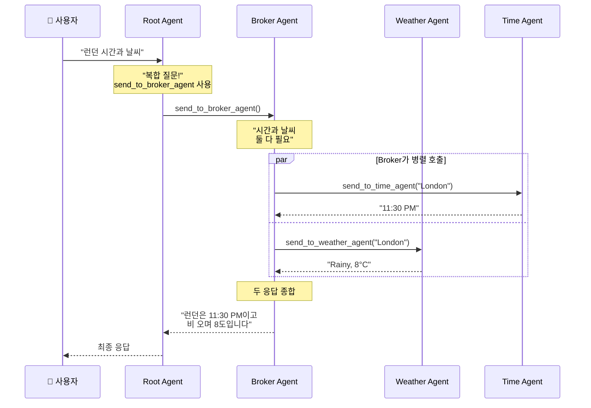

# A2A (Agent-to-Agent) Communication System

Google ADK 기반의 **진정한 다중 에이전트 통신 시스템**입니다. LLM이 도구를 통해 다른 에이전트와 통신하며 협력합니다.

## 🎯 핵심 특징

**진짜 A2A (Agent-to-Agent):**
- ✅ **LLM이 자연어로 의도 파악** - Python Regex/키워드 매칭 없음
- ✅ **Root Agent가 도구로 다른 에이전트 호출** - 순수 Tool 메커니즘
- ✅ **에이전트 간 동적 협업** - Broker가 Time + Weather 조율
- ✅ **확장 가능** - instruction만 수정하면 새 에이전트 추가 가능

## 📊 시스템 아키텍처

### 전체 구조


### 단일 질의 처리 흐름: "서울 날씨"


### 복합 질의 처리 흐름: "런던 시간과 날씨"


## 🚀 빠른 시작

### 1. 환경 설정

```bash
# 가상환경 생성 및 활성화
python -m venv .venv
.venv\Scripts\activate  # Windows
source .venv/bin/activate  # Linux/Mac

# 의존성 설치
pip install google-adk python-dotenv
```

### 2. API 키 설정

`.env` 파일 생성:
```bash
GOOGLE_API_KEY=your_actual_api_key_here
GOOGLE_GENAI_USE_VERTEXAI=False
```

### 3. 실행

```bash
python a2a_team_cli.py
```

## 💬 사용 예시

```
You: 서울 날씨
<<< 서울의 날씨는 흐림이며, 기온은 5°C입니다.

You: 내 이름은 JK
<<< 알겠습니다, JK님.

You: 단위를 화씨로 바꿔줘
<<< 단위를 화씨(°F)로 설정했습니다.

You: 도쿄 시간
<<< 도쿄의 현재 시간은 오전 4시 30분입니다.

You: 런던 시간과 날씨
<<< 런던의 현재 시간은 오후 11시 30분이며, 날씨는 비가 내리고 있고 기온은 46°F입니다.
```

## 🏗️ 프로젝트 구조

```
A2A_tutorial/
├── 📄 a2a_team_cli.py          # CLI 진입점 (Root Agent 직접 호출)
├── 📄 requirements.txt         # 의존성
├── 📄 .env.example            # 환경변수 템플릿
├── 📄 test_a2a.py             # A2A 통신 테스트
└── 📁 my_agent/
    ├── 📄 tools.py            # 🔧 도구 함수 (get_weather, get_time, A2A 도구)
    ├── 📄 team.py             # 🏗️ 팀 구성 및 A2A 도구 연결
    │
    ├── 📁 config/             # ⚙️ 설정
    │   └── settings.py        # 환경변수 로드 및 검증
    │
    ├── 📁 core/               # 🎯 핵심 추상화
    │   ├── memory.py          # 사용자 메모리 (이름/도시/단위)
    │   ├── session_manager.py # 세션 관리
    │   └── exceptions.py      # 커스텀 예외
    │
    ├── 📁 services/           # 🔄 비즈니스 로직
    │   ├── runner_pool.py     # Runner 풀 관리
    │   └── a2a_service.py     # A2A 통신 서비스 (핵심!)
    │
    └── 📁 agents/             # 🤖 에이전트 정의
        ├── weather_agent.py   # 날씨 에이전트
        ├── time_agent.py      # 시간 에이전트
        ├── broker_agent.py    # 중개 에이전트 (A2A 도구 보유)
        └── root_agent.py      # 루트 에이전트 (A2A 도구 보유)
```

## 🎯 핵심 개념

### 1️⃣ Agent (에이전트)
- **역할**: 특정 도메인의 작업을 처리하는 LLM 기반 엔티티
- **종류**:
  - **Root Agent**: 사용자 요청 진입점, 5개 도구 보유
  - **Weather Agent**: 날씨 정보 제공 (get_weather 도구)
  - **Time Agent**: 시간 정보 제공 (get_current_time 도구)
  - **Broker Agent**: 복합 정보 조율 (A2A 도구 2개)
- **구성**: `model`, `name`, `instruction`, `tools`

### 2️⃣ Tool (도구)
**데이터 도구:**
- `get_weather(city, units)` - 날씨 데이터 조회
- `get_current_time(city)` - 시간 데이터 조회

**A2A 통신 도구 (핵심!):**
- `send_to_weather_agent(city, user_id, session_id)` - Weather Agent 호출
- `send_to_time_agent(city, user_id, session_id)` - Time Agent 호출
- `send_to_broker_agent(city, user_id, session_id)` - Broker Agent 호출

**메모리 도구:**
- `update_user_name(name, user_id, session_id)` - 이름 설정
- `update_preferred_units(units, user_id, session_id)` - 온도 단위 설정

### 3️⃣ Runner
- **역할**: 에이전트를 실행하고 대화 관리
- **핵심 메서드**: `run_async()` - 비동기로 에이전트 실행
- **관리**: `RunnerPool`이 각 에이전트별 Runner 관리

### 4️⃣ A2A Service
- **역할**: 에이전트 간 통신의 핵심 레이어
- **위치**: `my_agent/services/a2a_service.py`
- **메커니즘**: 
  1. `send_to_agent(agent_name, message, ...)` 호출
  2. `RunnerPool`에서 대상 에이전트의 Runner 가져오기
  3. `runner.run_async()` 호출로 에이전트 실행
  4. 이벤트 스트림에서 최종 텍스트 추출 및 반환

### 5️⃣ Session Memory
- **역할**: 사용자별 개인화 데이터 저장
- **저장 항목**: `user_name`, `home_city`, `preferred_units`
- **활용**: A2A 도구 호출 시 컨텍스트 제공

## 🔄 A2A 통신의 진짜 의미

### ❌ Before (가짜 A2A - Python 라우팅)
```
사용자 → Python Router (Regex 매칭) → 에이전트 선택 → 실행
```
- Python 코드가 의도 파악
- if/else로 라우팅
- 에이전트는 서로 몰라요

### ✅ After (진짜 A2A - Tool 기반)
```
사용자 → Root Agent (LLM) → 도구 선택 → send_to_X_agent() → A2A Service → 에이전트 실행
```
- **LLM이 의도 파악**
- **도구로 에이전트 호출**
- **에이전트가 에이전트를 호출!**

### 핵심 차이점

| 항목 | Before (가짜 A2A) | After (진짜 A2A) |
|------|-------------------|------------------|
| 의도 파악 | Python Regex | LLM 자연어 이해 |
| 라우팅 결정 | Python if/else | LLM 도구 선택 |
| 에이전트 호출 | Python 함수 호출 | Tool 메커니즘 |
| Broker 역할 | 없음 | 하위 에이전트 조율 |
| 확장성 | 코드 수정 필요 | instruction만 수정 |

## 📝 지원 명령

- **날씨 조회**: "서울 날씨", "Tokyo weather"
- **시간 조회**: "도쿄 시간", "London time"
- **복합 조회**: "런던 시간과 날씨" (Broker 사용)
- **이름 설정**: "내 이름은 JK"
- **단위 설정**: "단위를 섭씨로", "단위를 화씨로"

## 🔧 확장 가이드

### 새 에이전트 추가하기 (진짜 A2A 방식)

#### 1. 도구 함수 작성 (`my_agent/tools.py`)
```python
def get_stock_price(symbol: str) -> dict:
    """주식 가격 조회"""
    return {"status": "success", "symbol": symbol, "price": "150.25"}
```

#### 2. 에이전트 생성 (`my_agent/agents/stock_agent.py`)
```python
from google.adk.agents import Agent
from ..tools import get_stock_price

def create_stock_agent() -> Agent:
    return Agent(
        name="stock_agent",
        model="gemini-2.0-flash",
        description="주식 가격 정보 제공",
        instruction="Use get_stock_price tool to fetch stock prices.",
        tools=[get_stock_price],  # 데이터 도구
    )
```

#### 3. A2A 통신 도구 추가 (`my_agent/tools.py`)
```python
def create_a2a_tools(a2a_service, session_manager):
    # 기존 도구들...
    
    async def send_to_stock_agent(symbol: str, user_id: str, session_id: str) -> str:
        """Send request to stock agent."""
        return await a2a_service.send_to_agent(
            agent_name="stock_agent",
            message=f"Get stock price for {symbol}",
            user_id=user_id,
            session_id=session_id
        )
    
    return {
        # 기존 도구들...
        "send_to_stock_agent": send_to_stock_agent,
    }
```

#### 4. Root Agent에 도구 추가 (`my_agent/agents/root_agent.py`)
```python
def create_root_agent(a2a_tools: dict) -> Agent:
    return Agent(
        name="root_agent",
        instruction=(
            "You are the root orchestrator agent. Your role is to:\n"
            "...\n"
            "- send_to_stock_agent(symbol, user_id, session_id): Get stock price\n"  # 추가!
            "..."
        ),
        tools=[
            # 기존 도구들...
            a2a_tools["send_to_stock_agent"],  # 추가!
        ],
    )
```

#### 5. 팀에 등록 (`my_agent/team.py`)
```python
from .agents import create_stock_agent

class AgentTeam:
    def __init__(self, session_service, app_name):
        # ...
        self.stock_agent = create_stock_agent()
        self.runner_pool.register_agent(self.stock_agent)
```

**끝!** Root Agent의 LLM이 자동으로 새 도구를 인식하고 사용합니다.

### 진짜 A2A의 장점

1. **Python 코드 수정 최소화**: instruction만 업데이트
2. **LLM이 자동 학습**: 도구 사용법을 자연어 instruction에서 학습
3. **동적 조합**: Broker 같은 조정자가 여러 에이전트 동적으로 호출
4. **확장성**: 에이전트 추가 시 기존 로직 영향 없음

## 🐛 문제 해결

### "Agent not found" 오류
- `RunnerPool`에 에이전트가 등록되었는지 확인
- `my_agent/team.py`의 `__init__`에서 `register_agent()` 호출 확인

### "Session not found" 오류
- CLI에서 `ensure_session()` 호출 확인
- `session_service.create_session()` 선행 실행 필요

### "function_call" 경고
- **정상 동작이며 무시 가능**
- 도구가 실행되고 있다는 신호 (LLM이 도구 호출 중)

### API 키 오류
- `.env` 파일에 `GOOGLE_API_KEY` 설정 확인
- `python-dotenv` 설치 및 `load_dotenv()` 호출 확인

### 응답이 없음
- Root Agent의 instruction 확인
- 도구 이름과 파라미터가 올바른지 확인
- A2A 도구가 `create_a2a_tools()`에 포함되었는지 확인

## 🎓 핵심 학습 포인트

### A2A란 무엇인가?

**정의**: Agent가 Tool을 통해 다른 Agent를 **동적으로** 호출하는 패턴

**구현 방식**:
1. A2A 통신 도구 생성 (`send_to_X_agent`)
2. 도구를 상위 에이전트에 등록
3. LLM이 자연어 instruction에서 사용법 학습
4. LLM이 상황에 맞게 도구 선택 및 호출

**장점**:
- 유연성: LLM이 동적으로 판단
- 확장성: 새 에이전트 추가 용이
- 조합성: Broker 패턴으로 복잡한 워크플로우 구성

## 📚 참고 자료

- [Google ADK Documentation](https://github.com/google/agentic-developer-kit)
- [Gemini API Documentation](https://ai.google.dev/docs)
- [GETTING_STARTED.md](GETTING_STARTED.md) - 초보자 가이드

## 📄 라이선스

MIT
